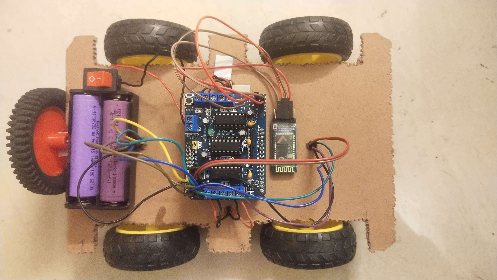
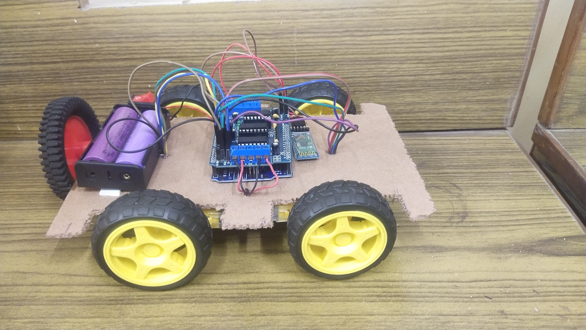
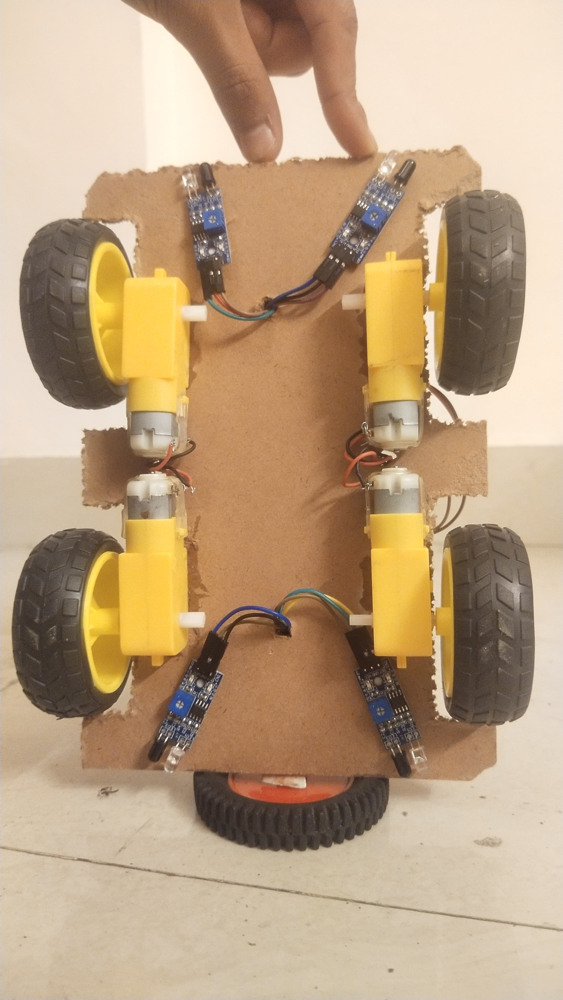

# Collision Avoiding RC Car Using Arduino Uno

This project demonstrates how to build a collision-avoiding remote-controlled car using an Arduino Uno and an L293D Motor Driver Shield. The car is equipped with 4 IR Proximity Sensor Modules to detect objects and automatically stop when an object is too close. It can also be controlled via a Bluetooth-enabled smartphone.

## Features

- Collision detection and avoidance using IR Proximity Sensors.
- Smartphone-controlled via Bluetooth.
- Smooth motor control using the L293D Motor Driver Shield.

---
## Components Required

- Arduino Uno
- L293D Motor Driver Shield
- 4 x IR Proximity Sensor Modules
- Bluetooth Module (e.g., HC-05 or HC-06)
- DC Motors
- Power Supply
- Chassis
- Connecting wires

---

## Setup and Wiring

1. Connect the L293D Motor Driver Shield to the Arduino Uno.
2. Attach the IR Proximity Sensors to the car's chassis to cover all sides (front, back, left, right).
3. Connect the Bluetooth Module to the Arduino.
4. Install the motors on the chassis and connect them to the L293D shield.
5. Power the Arduino and motor driver shield using an appropriate power source.

Refer to the code in `motor_control.ino` for pin configurations.

---

## Code

The Arduino sketch for this project is in the `motor_control.ino` file. It handles:

- Reading data from the IR Proximity Sensors.
- Controlling the motors via the L293D Motor Driver Shield.
- Receiving commands via Bluetooth.

---

## Images

### Top View

### Side View

### Bottom View

---

